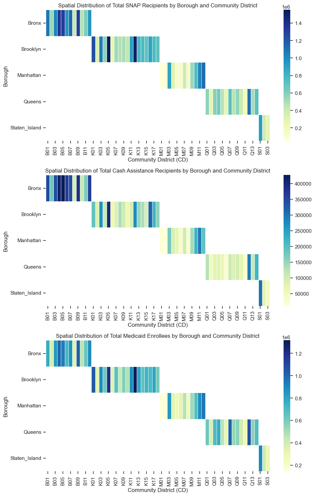
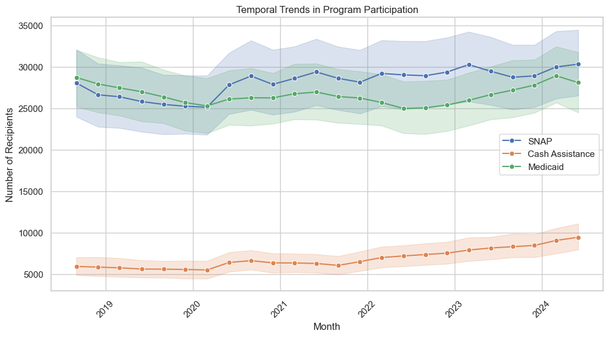
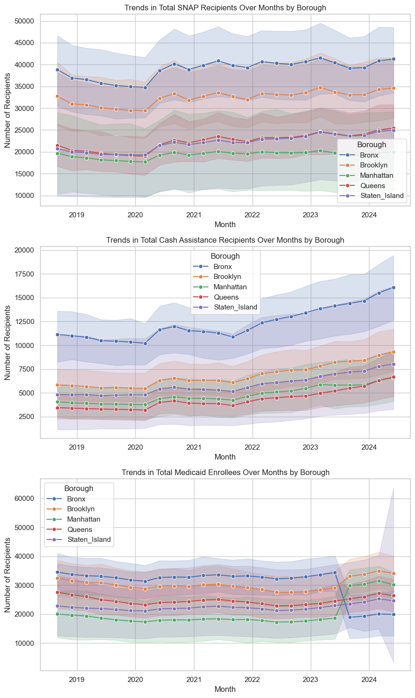

# NYC Public Assistance Analysis
#### This is a case study I created to gain insights into the distribution of individuals and households receiving government assistance programs such as Supplemental Nutrition Assistance Program (SNAP), Cash Assistance (CA), and Medicaid Benefits (MA) across different boroughs and community districts in New York City.

***
### Distribution of Social Service receipients throughout NYC boroughs

#### Key Findings
- The Bronx has the highest amount of public assistance recipients, indicating a higher demand for assistance in this borough.
- Brooklyn also has high concentrations across all forms of public assistance.
- Most districts in Manhattan do not require as much assistance, despite being more populated.
- Queens and Staten Island have some districts that have medium concentrations for SNAP and Medicaid recipients.

***
### Number of social service recipients over time

#### Key Findings
* SNAP and Medicade recipients have very similar values. It is possible that many of the recipients that receive one of those benefits receive both.
* Cash Assistance recipients do not seem to be correlated with SNAP or Medicaid recipients.

***
### Breakdown of recepients by borough over time

#### Key Findings
- There was a sudden increase after March 2020. This is likely due to the COVID-19 pandemic, as the resulting lockdown caused unemployment rates to increase.
- SNAP recipients have not decreased much since the COVID-19 pandemic.
- Cash assistance recipients in all 5 boroughs have been on an upward trend starting December 2021.
- Medicaid enrollees have increased significantly in Manhattan within the last 3 months. This is likely due to the fact that many migrants have moved into Manhattan this year and are eligible for Medicaid for the treatment of emergency medical conditions or parental care.

## Conclusion
Based on the analysis, it is evident that there are distinct patterns in the distribution of public assistance recipients across New York City boroughs and community districts. The Bronx and Brooklyn show higher concentrations of public assistance recipients, suggesting a greater demand for assistance in these areas. Manhattan, despite being more populated, has lower demand, while Queens and Staten Island have districts with varying levels of need.

The sudden increase in assistance recipients after March 2020 aligns with the onset of the COVID-19 pandemic, reflecting the economic impact and increased unemployment rates during the lockdown. The sustained high levels of SNAP recipients post-pandemic indicate ongoing economic challenges.

Cash assistance recipients have shown an upward trend in all boroughs since December 2021. Meanwhile, Medicaid enrollees have spiked in Manhattan recently, possibly due to an influx of migrants eligible for emergency medical treatment or parental care.

The correlation between SNAP and Medicaid recipients suggests overlap in these programs, while cash assistance recipients do not exhibit a strong correlation with SNAP or Medicaid recipients.
***
### Final Thoughts
The analysis provides valuable insights into the spatial and temporal dynamics of public assistance recipients in New York City. The identified patterns and correlations offer a foundation for informed decision-making, enabling the development of targeted interventions and policies to address socio-economic disparities and support vulnerable populations effectively. Continued monitoring and collaboration with stakeholders will be crucial to ensuring the sustained impact of these efforts.